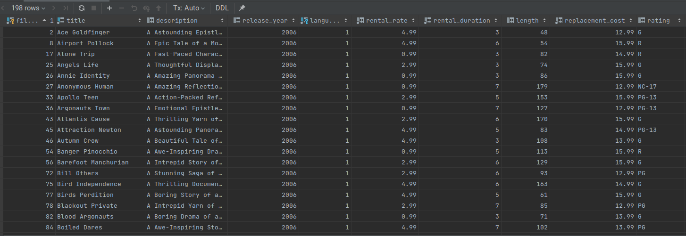

# OUTPUT



Note: Since the question says "Bigger or equal to 12.99 and less than 16.99" the answer: ```BETWEEN 12.99 AND 16.99```

is wrong. Because this query will return results those have 16.99 replacement_cost.